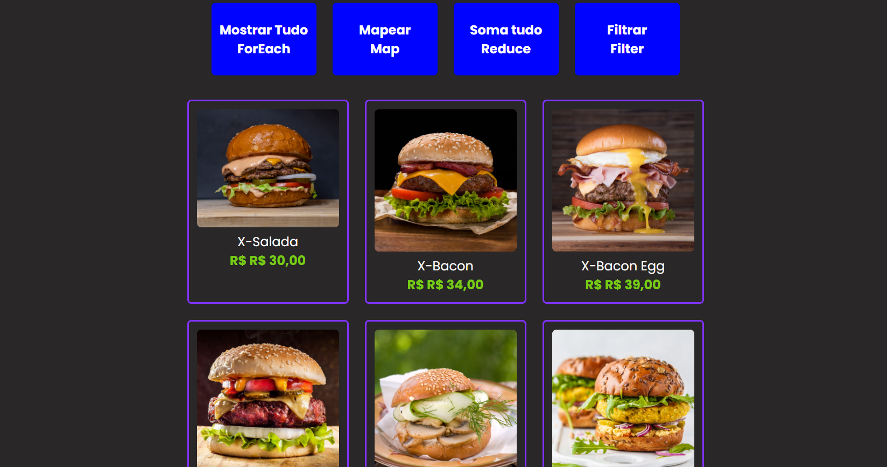

# 🍔 Menu Dinâmico com JavaScript

Aplicação web de cardápio interativo desenvolvida com HTML, CSS e JavaScript.  
O projeto demonstra a manipulação de dados utilizando métodos de arrays do JavaScript para renderizar produtos dinamicamente na tela.

## 🚀 Funcionalidades

- Exibir todos os produtos do cardápio
- Mapear os itens do menu
- Somar o valor total dos produtos
- Filtrar produtos específicos
- Interface simples e interativa

## 🧠 Conceitos aplicados

Este projeto foi desenvolvido para praticar conceitos importantes do JavaScript:

- Manipulação de arrays
- Métodos `forEach`
- Método `map`
- Método `reduce`
- Método `filter`
- Manipulação do DOM

## 🛠 Tecnologias utilizadas

- HTML5
- CSS3
- JavaScript

## 📷 Demonstração

## 🌐 Acesse o projeto

🔗 https://SEU-LINK-AQUI

## 📂 Como executar o projeto

1. Clone este repositório
